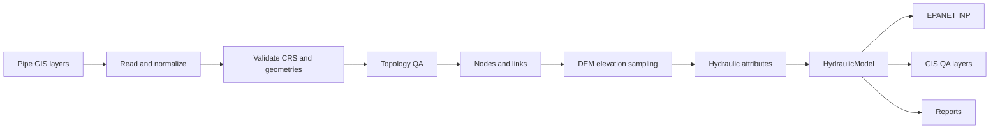

# Architecture

`epanet_tools` is designed as a reusable Python library for GIS-driven EPANET workflows.

The core idea is to separate four concerns:

1. **GIS data handling**: vector/raster reading, CRS checks, geometry normalization and output layers.
2. **Network topology**: endpoints, intersections, snapping, graph construction and validation.
3. **Hydraulic model semantics**: nodes, pipes, demands, reservoirs, valves, pumps and EPANET-ready attributes.
4. **Workflow orchestration**: reproducible YAML-driven pipelines and CLI entrypoints.

## Package structure

```text
src/epanet_tools/
├── io/              # GIS, raster and INP input/output
├── topology/        # topology validation and correction
├── terrain/         # DEM/DTM elevation sampling
├── hydraulic/       # hydraulic model building and EPANET semantics
├── editing/         # bulk and spatial editing rules
├── analysis/        # network/hydraulic analysis utilities
├── visualization/   # GIS outputs, QGIS styles and thematic maps
└── workflows/       # complete CLI/YAML workflows
```

## Intermediate model

The library should not write EPANET `.inp` files directly from raw GIS layers. Instead, it should build a typed intermediate model:

```text
HydraulicModel
├── nodes
├── pipes
├── reservoirs
├── tanks
├── pumps
├── valves
├── patterns
├── metadata
└── validation issues
```

This makes validation, editing and testing easier before serialization.

## Workflow direction



## First implementation target

The first real implementation should read a pipe layer and produce a QA report without modifying the source data. Automatic snapping, line splitting and `.inp` export should come after the validation contract is stable.
